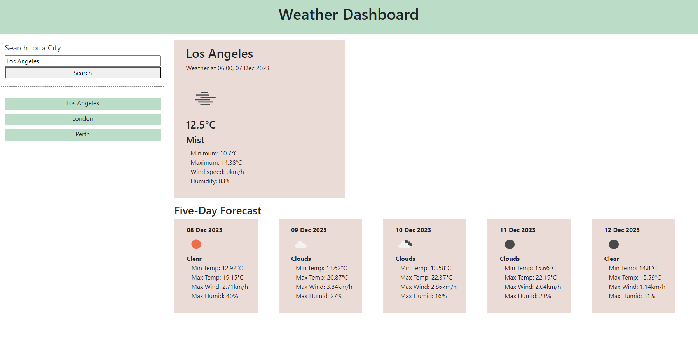

# Weather Dashboard
## Description
This project is a web-based search engine to access global weather data. It can be used to view weather conditions and 5-day forecasts for cities around the world.

## Installation
The webpage is hosted online and can be accessed using the following link: https://christiehyde.github.io/WeatherDashboard/

## Usage
A screenshot of the application is provided.

Users can type the name of a city into the search bar and submit to search for the most recent weather data for that city. The display will show a one-word summary for that city's conditions, along with an illustrative icon. The minimum and maximum temperature, wind speed and humidity are also shown, as well as the exact time the conditions were recorded.
The user can also view a 5-day forecast for that city, including average condition, minimum and maximum temperature, maximum wind speed and maximum humidity.

Previously searched cities are preserved in the sidebar underneath the search form. Clicking an item in this search history will retrieve the search results for that city.

## Credits
All weather data is obtained from OpenWeatherMap API in accordance with their free-to-use licences.
JQuery and Bootstrap libraries have been utilised in this project.
All other HTML, CSS and JavaScript was written by Christie Hyde for this project. 